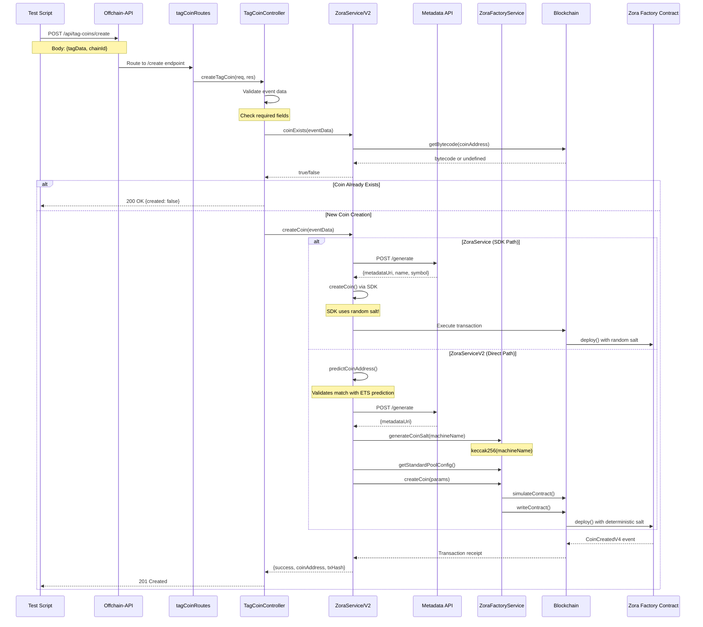

# TAG Coin Creation Flow - Sequence Diagram

## Overview
The offchain-api provides two implementations for creating TAG coins on Zora:
1. **ZoraService** - Uses the Zora SDK (`@zoralabs/coins-sdk`)
2. **ZoraServiceV2** - Direct factory contract interaction (deterministic)

## Current Architecture (Two Paths)



## Key Components

### 1. **Environment Configuration**
- `ETS_EOA_PRIVATE_KEY`: Private key for the EOA that signs transactions
- `CHAIN_ID`: Target chain (8453=Base, 84532=Base Sepolia, 31337=localhost)
- `METADATA_API_URL`: Internal metadata generation service

### 2. **ZoraService (Original - SDK Based)**
```typescript
// Problem: Uses random salt from SDK
await createCoin({
    name, symbol, uri,
    payoutRecipient: eventData.creator,
    platformReferrer: eventData.relayer,
    chainId: this.chainId,
    currency: DeployCurrency.ETH
}, walletClient, publicClient)
```

### 3. **ZoraServiceV2 (Direct Factory - Deterministic)**
```typescript
// Solution: Uses deterministic salt
const coinSalt = keccak256(toBytes(machineName));
await zoraFactory.createCoin({
    payoutRecipient, owners, uri, name, symbol,
    poolConfig, platformReferrer, coinSalt
})
```

### 4. **ZoraFactoryService (Direct Contract Interaction)**
- `generateCoinSalt()`: Creates deterministic salt from machine name
- `predictCoinAddress()`: Calculates address before deployment
- `createCoin()`: Direct factory contract call with full control
- `getStandardPoolConfig()`: ETH pairing configuration

## Address Prediction Matching

The critical requirement is that the offchain-api's predicted address MUST match the ETS contract's prediction:

```
ETS Contract (ETSToken.sol):
computeCoinAddress(machineName) → address

Offchain-API (ZoraFactoryService):
predictCoinAddress({msgSender, name, symbol, poolConfig, platformReferrer, coinSalt}) → address

Both MUST produce the same address!
```

## Current Issues & Solutions

### Issue 1: SDK Uses Random Salt
- **Problem**: `@zoralabs/coins-sdk` generates random salt internally
- **Impact**: Cannot predict addresses deterministically
- **Solution**: Use ZoraServiceV2 with direct factory interaction

### Issue 2: Address Mismatch Validation
- **Check**: ZoraServiceV2 validates prediction matches ETS
- **Location**: Line 111-114 in zoraServiceV2.ts
- **Action**: Throws error if mismatch detected

### Issue 3: Metadata Generation
- **Service**: Internal metadata API at `/api/metadata/generate`
- **Input**: originalInput, machineName, creator, relayer
- **Output**: IPFS URI for coin metadata

## Testing Strategy

1. **Dry Run Mode**: Validate all parameters without executing
2. **Prediction Testing**: Verify address calculations match
3. **Metadata Testing**: Ensure IPFS URIs are generated
4. **Simulation First**: Use `simulateContract` before actual execution
5. **Idempotency**: Check if coin exists before creation

## Next Steps

To test this flow with your smart wallet POC:
1. Call the offchain-api's `/api/tag-coins/create` endpoint
2. Provide TAG data that matches your smart wallet as creator
3. Verify the coin gets created with proper attribution
4. Check that the coin appears in the Zora profile