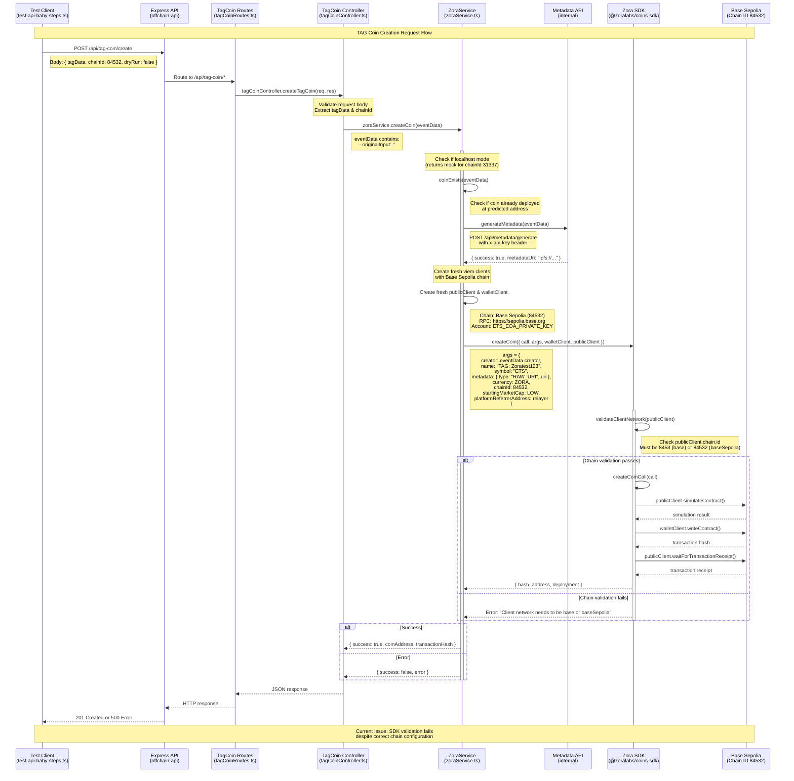

# ZoraService Call Stack Sequence Diagram

## TAG Coin Creation Flow

## Key Components

### 1. **ZoraService Initialization** (constructor)
- **Chain Selection**: `chainId === 84532 ? baseSepolia : base`
- **Client Creation**: Creates `publicClient` and `walletClient` with RPC URLs
- **Account Setup**: Uses `ETS_EOA_PRIVATE_KEY` for transactions

### 2. **ZoraService.createCoin()** Method Flow
1. **Localhost Check**: Returns mock data for `chainId === 31337`
2. **Existence Check**: Calls `coinExists()` to check if coin already deployed
3. **Metadata Generation**: Calls internal metadata API
4. **Fresh Client Creation**: Creates new viem clients (debugging step)
5. **SDK Call**: Calls Zora SDK with proper parameters

### 3. **Current Problem Location**
The issue occurs at the **SDK validation step**:
- Our `publicClient.chain.id = 84532` ✅
- Our manual validation `84532 === baseSepolia.id` returns `true` ✅  
- But SDK's `validateClientNetwork()` still throws error ❌

### 4. **Recent Fixes Applied**
- ✅ Fixed RPC URL configuration (`https://sepolia.base.org`)
- ✅ Fixed SDK function signature (using `{ call, walletClient, publicClient }`)
- ✅ Fixed parameter structure (wrapped in `call` object)
- ✅ Fixed currency constant (`CreateConstants.ContentCoinCurrencies.ZORA`)
- ✅ Fixed TypeScript imports (removed invalid `ValidMetadataURI`)

### 5. **Environment Configuration**
- **Chain ID**: 84532 (Base Sepolia)
- **RPC URL**: `https://sepolia.base.org`
- **Private Key**: `ETS_EOA_PRIVATE_KEY` environment variable
- **API Mode**: `NODE_ENV=production` (not development/localhost)