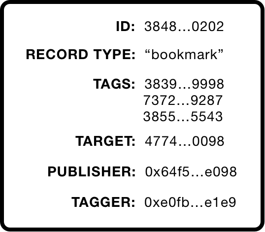

# Key concepts

In its simplest form, Ethereum Tag Service (ETS) is a composable web service (consumable by both front-end interfaces or via contract-to-contract interaction) that takes as input one or more tag strings and a target URI and combines those into a “tagging record” that is recorded, along with cryptographically ensured provenance and attribution, onto the blockchain.

- [Tag (CTAG)](#tag-ctag)
- [Target](#target)
- [Tagging Record](#tagging-record)
- [Relayer](#relayer)
- [Tagger](#tagger)
- [Creator](#creator)
- [Auctioneer](#auctioneer)
- [Owner](#owner)

---

## Tag (CTAG)


ERC-721 non-fungible token (CTAG) that stores a single tag string and origin attribution data including a Relayer address and a Creator address (see roles below).

One CTAG exists for a tag string regardless of its case. For example, #Punks, #punks and #PUNKS all resolve to the same CTAG.

CTAG Ids are the hashed, lowercased tag string cast as a uint256.

```solidity
/**
 * @notice Function to deterministically compute & return a CTAG token Id.
 *
 * Every CTAG token and its associated data struct is mapped to by its token Id. This Id is computed
 * from the "display" tag string lowercased, hashed and cast as an unsigned integer.
 *
 * Note: Function does not verify if CTAG record exists.
 *
 * @param _tag Tag string.
 * @return Id of potential CTAG token id.
 */
function computeTagId(string memory _tag) public pure returns (uint256) {
    string memory _machineName = __lower(_tag);
    return uint256(keccak256(bytes(_machineName)));
}
```

CTAGs are created automatically during content tagging, capturing attribution data in the process. They can also be created independently of the tagging process.

Once turned into a CTAG, any future use or reference to a tag string will map to its Id. There are no restrictions placed on the use of CTAGs; any Relayer can "use" any CTAG from the universe of CTAGs.

New CTAG tokens are transferred to ETS upon minting to be held for safekeeping. The current plan holds for releasing CTAGs to the public via an english style auction, though is no timeline or schedule for this on the roadmap.

## Target

Data structure, stored on-chain, that references/points to a URI. While a URI of any structure can be input as a Target (eg: "https://google.com", "), our indexing system, as much as possible, will restrict our interpretation & classification of URIs to the more technical parameters defined by the IETF in [RFC3986](https://www.rfc-editor.org/rfc/rfc3986). For newer protocols, such as blockchains we will lean on newer emerging URI standards such as the [Blink](https://w3c-ccg.github.io/blockchain-links) and [BIP-122](https://github.com/bitcoin/bips/blob/master/bip-0122.mediawiki)

### URI examples

Source: [Wikipedia](https://en.wikipedia.org/wiki/Uniform_Resource_Identifier), extended with [Blink URI scheme](https://w3c-ccg.github.io/blockchain-links/)

```text
    chain-name
    ┌───┴───┐
blink:polygon:mumbai:0x60Ae865ee4C725cd04353b5AAb364553f56ceF82:0x8635-0x0b
└─┬─┘        └───┬──┘└──────────────────────────┬──────────────────────────┘
scheme      chain-network                chain-asset-id

        userinfo       host      port
        ┌──┴───┐ ┌──────┴──────┐ ┌┴┐
https://john.doe@www.example.com:123/forum/questions/?tag=networking&order=newest#top
└─┬─┘   └───────────┬──────────────┘└───────┬───────┘ └───────────┬─────────────┘ └┬┘
scheme          authority                  path                 query           fragment


ldap://[2001:db8::7]/c=GB?objectClass?one
└┬─┘   └─────┬─────┘└─┬─┘ └──────┬──────┘
scheme   authority   path      query

mailto:John.Doe@example.com
└─┬──┘ └────┬─────────────┘
scheme     path

news:comp.infosystems.www.servers.unix
└┬─┘ └─────────────┬─────────────────┘
scheme            path

tel:+1-816-555-1212
└┬┘ └──────┬──────┘
scheme    path

telnet://192.0.2.16:80/
└─┬──┘   └─────┬─────┘│
scheme     authority  path

urn:oasis:names:specification:docbook:dtd:xml:4.1.2
└┬┘ └──────────────────────┬──────────────────────┘
scheme                    path
```

Target Id is the URI string, hashed and cast as a uint256.

```solidity
/**
 * @notice Function to deterministically compute & return a targetId.
 *
 * Every Target in ETS is mapped to by it's targetId. This Id is computed from
 * the target URI sting hashed and cast as a uint256.
 *
 * Note: Function does not verify if Target record exists.
 *
 * @param _targetURI Unique resource identifier Target record points to.
 * @return targetId Id of the potential Target record.
 */
function computeTargetId(string memory _targetURI) public pure returns (uint256) {
    bytes32 targetId = keccak256(bytes(_targetURI));
    return uint256(targetId);
}
```

## Tagging Record



Data structure, stored on-chain, that stores one or more Tag Ids connected to a Target Id by a given Tagger + Relayer combination. Also included is a Record Type flag that gives Relayer (or potentially a Tagger) a means to provide context to the Tagging Record.

Semantically, a Tagging Record reflects **"who tagged what, with which tags, from where and why"**.

Every Tagging record has a unique Id computed from the hashed composite of Target Id, Record Type, Tagger and Relayer addresses cast as a uint256.

```solidity
/**
 * @notice Compute & return a taggingRecordId.
 *
 * Every TaggingRecord in ETS is mapped to by it's taggingRecordId. This Id is a composite key
* composed of targetId, recordType, relayer contract address and tagger address hashed and cast as a uint256.
 *
 * @param _targetId Id of target being tagged (see ETSTarget.sol).
 * @param _recordType Arbitrary identifier for type of tagging record.
 * @param _relayer Address of tagging record Relayer contract.
 * @param _tagger Address interacting with Relayer to tag content ("Tagger").
 *
 * @return taggingRecordId Unique identifier for a tagging record.
 */
function computeTaggingRecordIdFromCompositeKey(
    uint256 _targetId,
    string memory _recordType,
    address _relayer,
    address _tagger
) public pure returns (uint256 taggingRecordId) {
    taggingRecordId = uint256(keccak256(abi.encodePacked(_targetId, _recordType, _relayer, _tagger)));
}
```

Given this design, a Tagger who tags the same URI (Target Id) with the same tags (Tag Ids) and Record Type identifier via two different Relayers will produce two tagging records in ETS.

Only Relayers (via a Relayer contract) may call ETS Core to record Tagging Records. These calls may be initiated by a user of the Relayer application or by the Relayer itself; either way, the wallet address that initiates the tagging record receives attribution as the "Tagger".

Tagging records may be updated to have Tag Ids added or removed. Tag Ids are the only element of a tagging record that may be changed and these updates may only be carried out by the original Tagger address via the original Relayer contract.

ETS Core has the option to charge a per-tag micro-fee to add tags to a Tagging Record. When a per-tag fee is charged, proceeds are broken up an distributed to the original CTAG Creator and original CTAG Relayer according to preset percentages governed by ETS. See [ETS.setTaggingFee](./backend-api/ETS.md#settaggingfee) & [ETS.setPercentages](./backend-api/ETS.md#setpercentages)

## Relayer

Third-party dApps, platforms or projects that implement ETS are referred to as “Relayers”.

As mentioned in the previous section on Tagging Records, ETS Core restricts writing of tagging records to enabled Relayer Contracts. The purpose for this is to allow third-party dApps, platforms or projects that implement ETS to record provenance and attribution of their application.

All Relayers must deploy a Relayer contract. The address of a Relayer contract becomes a Relayer ID. In this way, Relayers and Relayer contracts are synonymous in ETS.

For those wanting to test ETS, Relayer contracts can be quickly and easily deployed using our Relayer Factory. Currently the Relayer Factory deploys ETSRelayerV1.sol, a simple, ETS designed implementation of the ETS Core Tagging API found in ETS.sol contract.

For more advanced or custom tagging scenarios (eg. restricting Target Ids or Tag Ids or Tagger addresses), third-parties may develop and deploy their own Relayer contracts and submit them for white-listing by ETS.

## Tagger

Wallet address credited with initiating a Tagging Record via a Relayer Contract. The Tagger address and the Relayer address in a Tagging Record can be the same, in which case the Relayer is the Tagger.

## Creator

Wallet address credited with creating a new, original CTAG via a Relayer Contract. Can also be the Relayer. The Creator address and the Relayer address for a CTAG can be the same, in which case the Relayer is the Creator.

## Auctioneer

Address of the contract (or contract owner) that supports sale of a CTAG. ETS will be the first auctioneer via ETSAuctionHouse.sol

## Owner

Wallet address that purchases a CTAG at via ETSAuctionHouse or secondary market
